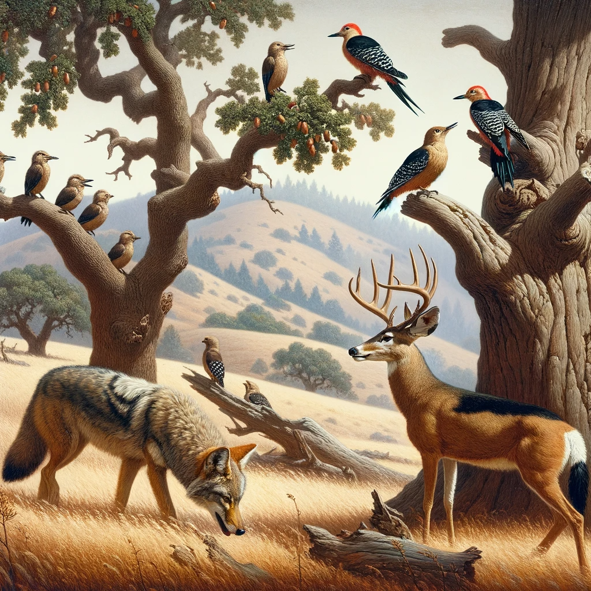
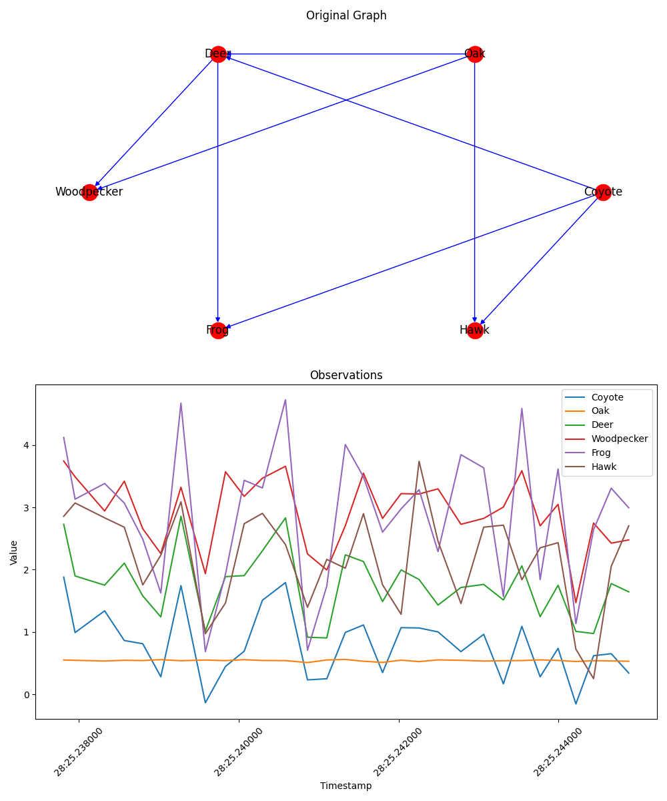

# Identifying Causal Gateways and Mediators in a Complex spatio-temporal systems. 
===========================================

## Abstract
In this work, the principles of Causal Structure Discovery (CSD) and deep learning methodologies, traditionally applied to climate systems are extended, to the realm of biodiversity, specifically focusing on species distribution and interaction models. By integrating these models with existing climatic system frameworks, the aim is to uncover causal gateways and pinpoint perturbation points within ecosystems. This integrative approach allows us to unravel the complex interdependencies in ecological networks, highlighting the vulnerability of keystone species to changes in the ecosystem and tracing the propagation of perturbations across various species. This study not only provides a novel perspective on the dynamics of species interactions in response to climatic shifts but also sets a new benchmark in the combined application of CSD and deep learning in ecological research. This work is pivotal in understanding the cascading effects of environmental changes on biodiversity, offering insights into conservation strategies and the sustainable management of ecosystems.

## Introduction
Causation is a direct effect between variable X and Y that remains after adjusting for confounding. Confounding can be observed or unobserved. 
Since the 17th century modern science, we have had two kinds of scientific methods for discovering causes. 
The first method involved manipulating and varying features of a system to see what other features do or do not change. 
While there are many experiments that fit this methods perhaps the most famous one is Pavlov's classical conditioning experiment, where he established a stimulus-response connection. 
These methods shone brightly but manipulating systems like live animals or environments are bounded by ethics and costs. The notorious experiments like Tuskegee study and prison experiments among others have shown us why the intervention methods are dangerous. 
The other scientific methods for discovering causes involved observing the variation of features of system without manipulation. 
In these methods observational data will be collected for a system and just by observing who different attributes of a system changes causal connections can be established between different parts of the system. 
Some examples, include discovering astronomical objects through observational data or connecting weather patterns through remote sensing data.

## Acknowledgement and References
* [Introduction to foundations of Causal Discovery](https://link.springer.com/article/10.1007/s41060-016-0038-6)
* [Review of Causal Discovery Methods Based on Graphical Models](https://www.ncbi.nlm.nih.gov/pmc/articles/PMC6558187/)
* [Dynamic Relational Inference in Multi-Agent Trajectories](https://arxiv.org/abs/2007.13524)
* [Amortized Causal Discovery](https://arxiv.org/abs/2006.10833)
